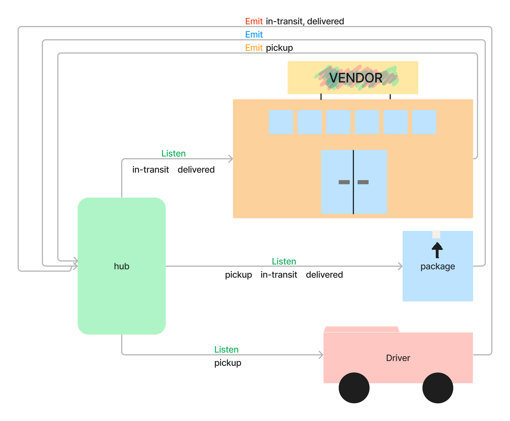
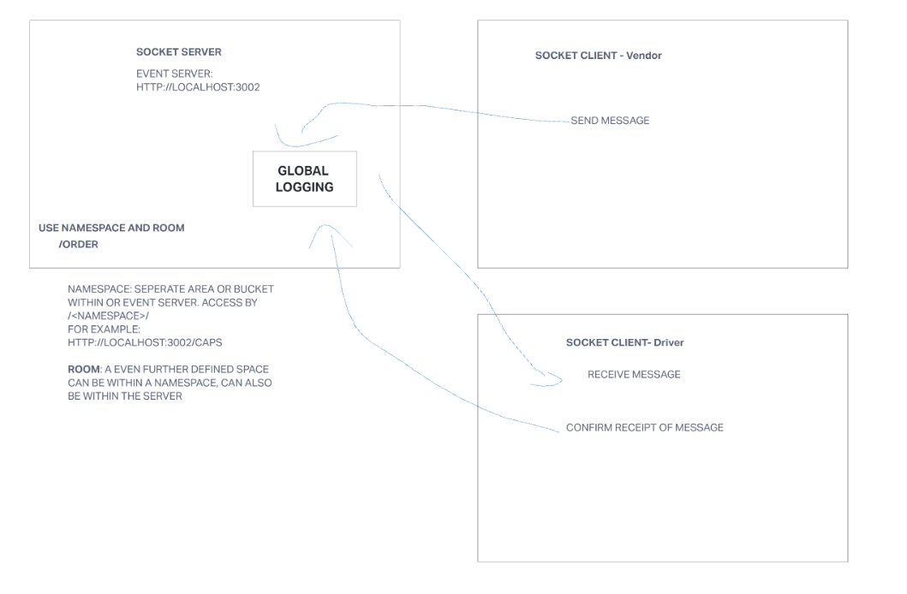
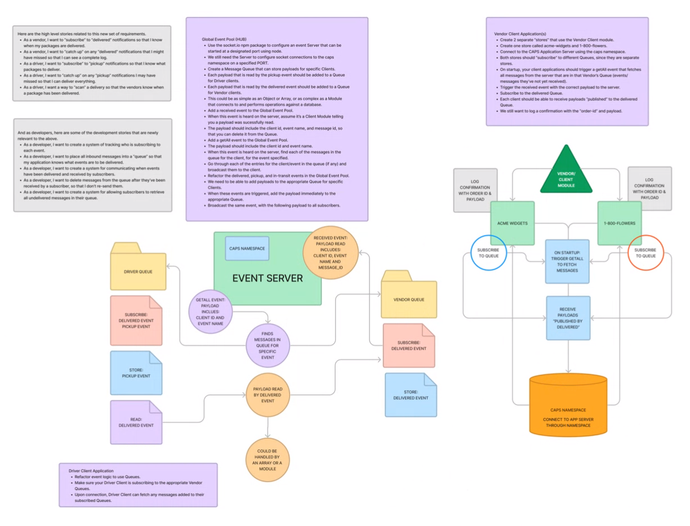

# CAPS

## Author: Luis Rosales

## Problem Domain

## Phase 1

A build of an application for a product called CAPS - The Code Academy Parcel Service. In this sprint, we’ll build out a system that emulates a real world supply chain. CAPS will simulate a delivery service where vendors (such a flower shops) will ship products using our delivery service and when our drivers deliver them, each vendor will be notified that their customers received what they purchased. This will be an event driven application that “distributes” the responsibility for logging to separate modules, using only events to trigger logging based on activity.

## Phase 2

Continue working on a multi-day build of our delivery tracking system, creating an event observable over a network with Socket.io.In this phase, we’ll be moving away from using Node Events for managing a pool of events, instead refactoring to using the Socket.io libraries. This allows communication between Server and Client applications.
The intent here is to build the data services that would drive a suite of applications where we can see pickups and deliveries in real-time.

## Phase 3

In Phase 3, we are building a set of features to help manage deliveries made by CAPS Drivers. This will simulate a delivery driver receiving a list of orders from a Queue and “scanning” package codes on delivery. Retailers will be able to see in their dashboard or log, a list of all packages delivered in real time. Should a delivery driver deliver many packages while the retailer is not connected to the dashboard, the vendor client should be guaranteed to receive “delivery” notifications from the Queue system.

## Dependencies

* JEST
* CHANCE
* SOCKET.IO
* SOCKET.IO-CLIENT

### Setup

* npm init
* create basic application foundation
* npm i jest, chance, socket.io, socket.io-client

### UML

Created UML for lab 11 with Taylor Main
Created UML for lab 13 with Brandon Pitts, Tyler Main and Stephanie hill

